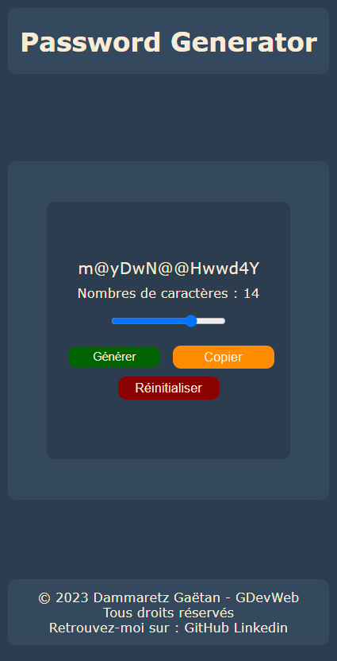

# Password-Generator-APP - Générateur de Mot de Passe 

Bienvenue dans le Générateur de Mot de Passe, une application simple pour créer des mots de passe sécurisés avec style. Utilisez ce générateur de mot de passe élégant pour générer des mots de passe forts et uniques. Profitez des fonctionnalités telles que l'ajustement du nombre de caractères, la génération, la copie et la réinitialisation des mots de passe.

## Table des matières

- [Password-Generator-APP - Générateur de Mot de Passe](#password-generator-app---générateur-de-mot-de-passe)
  - [Table des matières](#table-des-matières)
  - [Aperçu](#aperçu)
  - [Technologies Utilisées](#technologies-utilisées)
  - [Comment Utiliser](#comment-utiliser)
  - [Installation](#installation)
  - [Crédits](#crédits)
  - [Contact](#contact)
- [Style CSS](#style-css)
- [App.js](#appjs)

## Aperçu

<p align="center">
  
</p>

## Technologies Utilisées

- HTML
- CSS
- JavaScript

## Comment Utiliser

1. Ouvrez le fichier `index.html` dans votre navigateur.
2. Utilisez les boutons "Générer", "Copier" et "Réinitialiser" pour contrôler le générateur de mot de passe.
3. Ajustez le nombre de caractères à l'aide de l'entrée de plage.

## Installation

1. Clonez le dépôt sur votre machine locale.

    ```bash
    git clone https://github.com/Aescanor/password-generator.git
    ```

2. Ouvrez le fichier `index.html` dans votre navigateur.

## Crédits

- Conçu et développé par [Dammaretz Gaëtan](https://github.com/Aescanor).

## Contact

- GitHub: [Votre GitHub](https://github.com/Aescanor)
- LinkedIn: [Votre LinkedIn](https://www.linkedin.com/in/ga%C3%ABtan-dammaretz/)

© [Dammaretz Gaëtan] - GDevWeb. Tous droits réservés.

---

# Style CSS

```css
:root {
  --mainColor: #2c3d50;
  --secondColor: #34495e;
}

/* ... (le reste du CSS) ... */
```

# App.js

```javascript
// ... (le reste du JavaScript) ...
```
